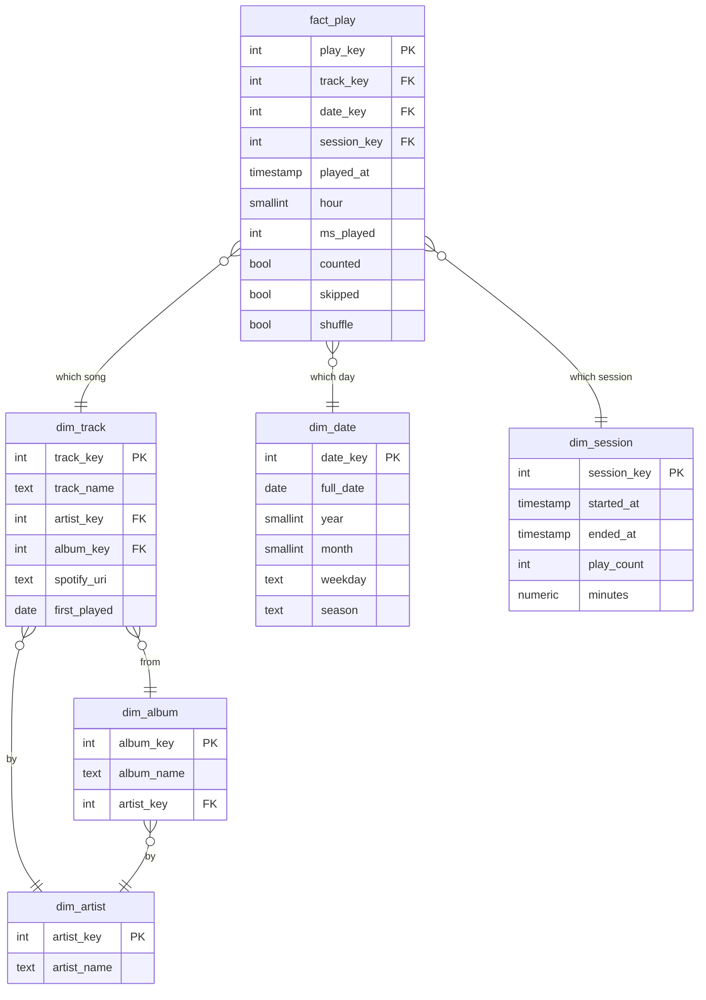

# Listening History

*Four years of my Spotify listening, 182,293 records, turned into a data warehouse and a story you can scroll through.*

**Live:** [listening-history.onrender.com](https://listening-history.onrender.com)

## Ownership

© 2026 Suhani Tiwari. **All rights reserved.** This is my original work. The code is public so you can see how I build, not so you can reuse it: copying, reusing or republishing any part of it, including for a portfolio or a class assignment, is not permitted without my written permission. See [LICENSE](LICENSE).

## What it is

Spotify lets you download your full streaming history: every song, the second it played, and how long you listened. Mine is **182,293 records** from May 2022 to September 2026. This project runs it through a Python ETL pipeline into a star schema in PostgreSQL, so questions like *which artist owned each month of my life* or *what's my longest streak of playing one song every day* become SQL. A FastAPI app then tells the answers as a six-chapter site (Obsessions, Eras, Habits, Loyalty, Discovery, Build).

## How it's built

### The pipeline

[`etl/pipeline.py`](etl/pipeline.py) is a plain-Python ETL with no pandas:

| Step | What happens |
|---|---|
| **Extract** | Reads every `Streaming_History_Audio_*.json` straight out of Spotify's zip |
| **Transform** | Keeps songs only (no podcasts), drops private-session plays, removes fields that aren't mine to publish (IP address, country, device), converts UTC to Austin time, removes duplicates and two documented overnight loops (a song left on repeat while I slept), merges the different IDs Spotify gives one song (single, album, deluxe) by normalized title and artist, and groups plays into listening sessions |
| **Load** | Runs referential-integrity checks before anything is written, writes one CSV per table, and bulk-loads them into PostgreSQL with `COPY` |

On my real export it processes all 182,293 records in about two seconds:

```
extracted 182,293 records -> 181,687 song plays (91,631 counted, 30s+)
  dim_artist      2,571 rows
  dim_album       6,320 rows
  dim_track       9,514 rows
  dim_date        1,592 rows
  dim_session     5,057 rows
  fact_play     181,687 rows
```

### The data model

A star schema: one fact table for every play, surrounded by the things a play is about.



- **Short plays stay in the fact table.** `counted` marks plays of 30 seconds or more (Spotify's own rule for a stream), so skips can be studied instead of thrown away.
- **Sessions are their own dimension.** A new session starts after a gap of more than 30 minutes, which makes questions about *how* I listen possible, not just *what*.
- **A full calendar.** `dim_date` has every day, including days with no listening, so streaks and gaps are measured correctly.
- **Indexes on every join,** plus a partial index on counted plays, the filter almost every question uses.

The full DDL is in [`sql/schema.sql`](sql/schema.sql).

### The questions, in SQL

[`sql/insights.sql`](sql/insights.sql) answers each question as a PostgreSQL view:

| View | Question | Technique |
|---|---|---|
| `v_monthly_eras` | Who owned each month of my life? | `RANK()` window per month, share of listening |
| `v_song_streaks` | Most days in a row I played one song | Gaps and islands with `ROW_NUMBER()` |
| `v_first_listen_to_obsession` | How fast did a song go from new to on repeat (25 listens)? | `ROW_NUMBER()` milestones with `FILTER` |
| `v_skip_rate` | Which artists do I start and not finish? | Conditional aggregation, `HAVING` |
| `v_listening_clock` | When do I listen, and did it change by year? | Window share of a partitioned total |
| `v_year_in_review` | Each year in one row, with a song of the year | CTEs, `DISTINCT ON` |
| `v_most_in_a_day` | My most intense single days with one song | Grouping by day and song |

A few answers from my own data:

- **Longest streak:** "intro (end of the world)" by Ariana Grande, every day for 21 days (April 1 to 21, 2024)
- **Most in one day:** "Until I Found You", 119 times on January 9, 2023
- **Biggest year:** 2023, with 1,639 hours of listening
- **Peak hour:** 5 PM in 2022 and 2023, 7 PM in 2024

### The API

[`app/main.py`](app/main.py) is a FastAPI server with 22 JSON endpoints over a `psycopg` connection pool. It connects as a **read-only database user** (`listening_reader`) that can read every table and view and change nothing, so even a bug in the app can't alter the data. Answers are cached in memory since the history only changes when the pipeline reloads it, and visitor-typed lookups are capped so the cache can't grow without bound. Song previews and music videos come from the iTunes Search API, fetched concurrently with `httpx` and `asyncio.gather`, throttled by a semaphore to stay polite to the API. The API documents itself at `/api/docs`.

## Design choices

The site reads like a story about one person's taste rather than a dashboard:

- **The dynasty:** one square per month colored by its #1 artist, the longest reigns, and who ever took the throne
- **Scrub through time:** drag through every month to see who owned it, then open its top five
- **The life of a song:** tap any title for its first listen, 25th listen, biggest day, longest streak, longest silence and a month-by-month chart
- **Listening clock:** a 24-hour dial that reshapes for each year
- **Streak race:** the longest daily streaks, animated
- **How I changed** and **Compare two eras:** any two years or seasons side by side, to see which version of me explored more and which repeated more
- **Discovery** and **Loyalty:** how much of each year went to new songs and artists, the songs I've played every single year, and how much goes to just ten artists
- **Play:** "Which did I play more?" and "Guess the stat," two games built from the real numbers
- **Your turn:** type any artist to see whether I listen to them, where they rank and my most-played song of theirs
- **How it works:** tap through the pipeline with the real code behind each step, and open each table of the star schema
- **The report:** a three-page print-styled PDF of the four years, rendered from `/report` and downloadable at `/report.pdf`

Bad data is handled honestly: the two overnight loops are listed in the pipeline with the date, song and reason ("I was asleep, not obsessed") instead of being silently filtered.

## Privacy

My real export never goes in this repo. It includes an IP address and country for every play, so `.gitignore` blocks the zip and every raw file, and the pipeline drops those fields before anything is written. Plays from private sessions are left out entirely.

## Tech stack

Python, PostgreSQL (star schema, window functions, views), FastAPI, psycopg 3 with connection pooling, httpx, vanilla JavaScript, HTML/CSS, Render.

## Run it locally

The repo includes a small **made-up** history in Spotify's exact format, so you can run the whole pipeline without my data:

```bash
python3 etl/pipeline.py --input sample/sample_history.json --out build/
```

To load into PostgreSQL and start the app:

```bash
pip install -r requirements.txt
export DATABASE_URL="postgresql://..."
python3 etl/pipeline.py --input sample/sample_history.json --out build/ --load
uvicorn app.main:app --reload
```

To run it on your own listening, request your **Extended streaming history** from Spotify's Privacy page and point `--input` at the zip they send.

## Coming next

- Song similarity with embeddings and `pgvector`: "what else do I listen to like this?"

Built by [Suhani Tiwari](https://suhanitiwari.com).
