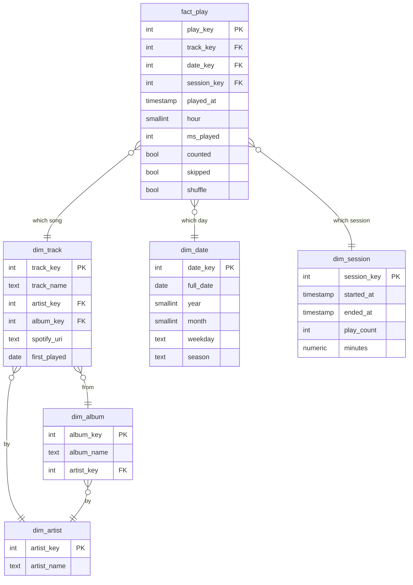

# Listening History

Four years of my Spotify listening, turned into a data warehouse.

Spotify lets you download your full streaming history: every song, the second it played, and how long you listened. Mine is **182,293 records** from May 2022 to September 2026. This project runs it through an ETL pipeline into a star schema in PostgreSQL, so questions like *which artist owned each month of my life* or *what's my longest streak of playing one song every day* become SQL.

Built by [Suhani Tiwari](https://suhanitiwari.com), MIS at McCombs, UT Austin.

## The pipeline

`etl/pipeline.py` is a plain Python ETL:

| Step | What happens |
|---|---|
| **Extract** | Reads every `Streaming_History_Audio_*.json` straight out of Spotify's zip |
| **Transform** | Keeps songs only (no podcasts), drops private-session plays, removes the fields that aren't mine to publish (IP address, country, device), converts times to Austin time, removes duplicate records, merges the different IDs Spotify gives one song (single, album, deluxe), and groups plays into listening sessions |
| **Load** | Runs integrity checks, writes one CSV per table, and bulk-loads them into PostgreSQL with `COPY` |

On my real export it processes all 182,293 records in about two seconds:

```
extracted 182,293 records -> 181,687 song plays (91,631 counted, 30s+)
  dim_artist      2,571 rows
  dim_album       6,320 rows
  dim_track       9,514 rows
  dim_date        1,592 rows
  dim_session     5,057 rows
  fact_play     181,687 rows
```

## The data model

A star schema: one fact table for every play, surrounded by the things a play is about.



Design choices:

- **Short plays stay in the fact table.** `counted` marks plays of 30 seconds or more (Spotify's own rule for a stream), so skips can be studied instead of thrown away.
- **Sessions are their own dimension.** A new session starts after a gap of more than 30 minutes, which makes questions about *how* I listen, not just *what*, possible.
- **A full calendar.** `dim_date` has every day, including days with no listening, so streaks and gaps are measured correctly.
- **Indexes on every join,** plus a partial index on counted plays, the filter almost every question uses.

The full DDL is in [`sql/schema.sql`](sql/schema.sql).

## The questions, in SQL

[`sql/insights.sql`](sql/insights.sql) answers each question as a PostgreSQL view:

| View | Question | Technique |
|---|---|---|
| `v_monthly_eras` | Who owned each month of my life? | `RANK()` window per month, share of listening |
| `v_song_streaks` | Most days in a row I played one song | Gaps and islands with `ROW_NUMBER()` |
| `v_first_listen_to_obsession` | How fast did a song go from new to on repeat (25 listens)? | `ROW_NUMBER()` milestones with `FILTER` |
| `v_skip_rate` | Which artists do I start and not finish? | Conditional aggregation, `HAVING` |
| `v_listening_clock` | When do I listen, and did it change by year? | Window share of a partitioned total |
| `v_year_in_review` | Each year in one row, with a song of the year | CTEs, `DISTINCT ON` |
| `v_most_in_a_day` | My most intense single days with one song | Grouping by day and song |

A few answers from my own data:

- **Longest streak:** "intro (end of the world)" by Ariana Grande, every day for 21 days (April 1 to 21, 2024)
- **Most in one day:** "Party In The U.S.A.", 145 times on March 21, 2023
- **Biggest year:** 2023, with 1,639 hours of listening
- **Peak hour:** 5 PM in 2022 and 2023, 7 PM in 2024

## Try it

The repo includes a small **made-up** history in Spotify's exact format, so you can run the whole pipeline without my data:

```bash
python3 etl/pipeline.py --input sample/sample_history.json --out build/
```

To load into PostgreSQL:

```bash
pip install "psycopg[binary]"
export DATABASE_URL="postgresql://..."
python3 etl/pipeline.py --input sample/sample_history.json --out build/ --load
```

To run it on your own listening, request your **Extended streaming history** from Spotify's Privacy page and point `--input` at the zip they send.

## Privacy

My real export never goes in this repo. It includes an IP address and country for every play, so `.gitignore` blocks the zip and every raw file, and the pipeline drops those fields before anything is written. Plays from private sessions are left out entirely.

## Coming next

- SQL insights: monthly eras, daily streaks, first listen to obsession, skip rate, and a listening clock by year
- An interactive page on [suhanitiwari.com](https://suhanitiwari.com)
- Song similarity with embeddings and `pgvector`: "what else do I listen to like this?"
